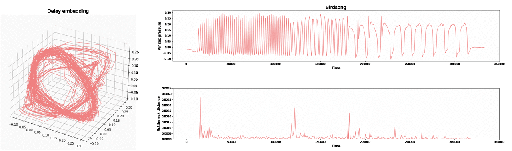

# intrinsicPH

_Author:_ Ximena Fernández

* This is the code related to the computational experiments of the article:
<a href="https://arxiv.org/abs/2012.07621" target="_blank"> Intrinsic persistent homology via density-based metric learning </a>

* An introductory presentation of the theory can be found at the <a href="https://www.youtube.com/watch?v=1lP9ndiM60o" target="_blank"> Tutorial: Intrinsic persistent homology</a>

* An example of an application of the method to pattern recognition in signals is the detection of syllables in a birdsong using an approximate of the first order derivative of the Fermat-based persistence diagrams of the delay embedding.

